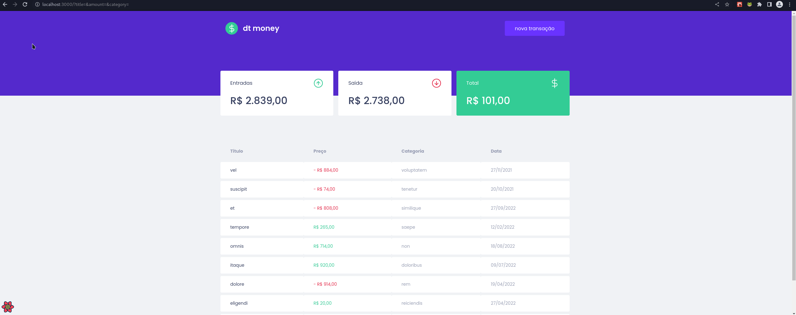

<h1 align="center">DtMoney</h1>

<p align="center">Project to learn react-query and react-hook-forms</p>

<p align="center" style="font-size: 18px;">
  <a href="#project">Project</a>&nbsp;&nbsp;&nbsp;|&nbsp;&nbsp;&nbsp;
  <a href="#techs">Techs</a>&nbsp;&nbsp;&nbsp;|&nbsp;&nbsp;&nbsp;
  <a href="#how-to-use">How to use</a>&nbsp;&nbsp;&nbsp;|&nbsp;&nbsp;&nbsp;
</p>


<div align="center">

  
  
  
</div>

# Project

## Preview

<p align="center">
  
</p>


# Techs

- [React](https://pt-br.reactjs.org/)
- [Vite](https://vitejs.dev/)
- [Circle Ci](https://circleci.com/)
- [Code Climate](https://codeclimate.com/)
- [React Query](https://tanstack.com/query/v4/?from=reactQueryV3&original=https://react-query-v3.tanstack.com/)
- [React Hook Forms](https://react-hook-form.com/)


# How to Use

## Clone the repository

```sh
 
git clone https://github.com/eduahcb/dtmoney

cd dtmoney

```

### Install Dependencies

```sh
  yarn install
```

### Run the project

```sh
 yarn dev
```

### Run the testes

```sh
 yarn test
```

### Run the Test Coverage

```sh
 yarn coverage
```
 